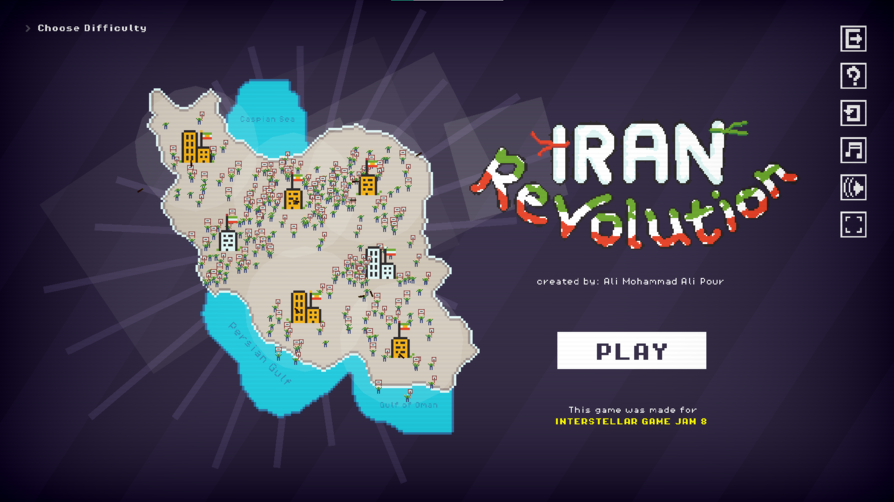
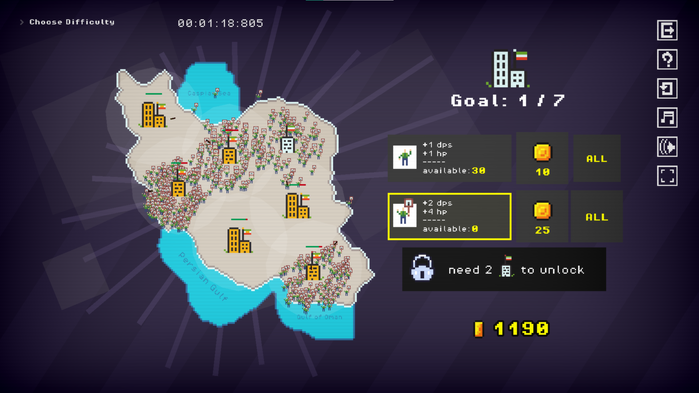
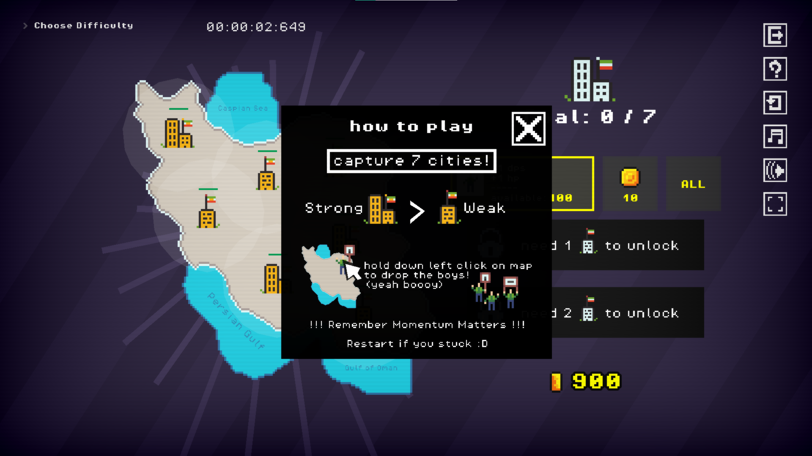

## Links

* Itch page: [https://ali-pouris.itch.io/iran-revolution](https://ali-pouris.itch.io/iran-revolution)
* Gameplay video (YouTube): [https://youtu.be/nu1zQp0_GZc?t=7527](https://youtu.be/nu1zQp0_GZc?t=7527)

# IRAN Revolution

In this game, you must lead a revolution and take control of all the cities. But remember—cities can slip out of your control, so act fast! ⚡

## Disclaimer

This game is a work of fiction created solely for entertainment purposes. It is not intended to insult or criticize any regime, nor does it have any political agenda. The regimes depicted within the game are entirely fictional, as is the revolution portrayed. Any resemblance to real events, persons, or entities is purely coincidental.

## Gameplay

Use the single or **“Buy All”** button to purchase your troops, then select the unit you want to deploy. After that, hold down the left mouse button on the map to deploy your forces.

## How to Play

* Capture cities quickly. The first time you capture a city, you’ll earn a large money reward. Subsequent captures of the same city yield smaller rewards.
* **Single-building** cities have less health than **two-building** cities. 👉 Strategy tip: capture the single-building cities first and focus your troops on these four cities before moving on to the two-building ones, since two-building cities also deal more damage.
* If you can control **all seven cities**, even for a single moment, **you win**.
* Out of coins or stuck? Hit the **restart** button (top-right) and try again—this time, spend your resources wisely!

## Developer's Note

This game was created for **Interstellar Game Jam 8**.

I still can’t believe I managed to make a game in just a few days! This is only the second game I’ve ever made—my first one took three whole months to finish. Joining this game jam was a really valuable experience for me.

The game includes multiple difficulty levels. Personally, I was only able to get as far as Hard mode.

Oh, and yes… there’s an infinite money glitch. Could I have patched it? Sure. Did I keep it in anyway? Absolutely.

Originally, the game was supposed to be different: each city would spawn guards, protesters would clash with them, and then move on to the city itself. But due to limited time, I had to simplify the design.

## Screenshots

## Credits

* **Developer:** Ali Mohammad Ali Pour
* **Game Jam:** Interstellar Game Jam 8

## License

This project is **free to use for everyone**.
